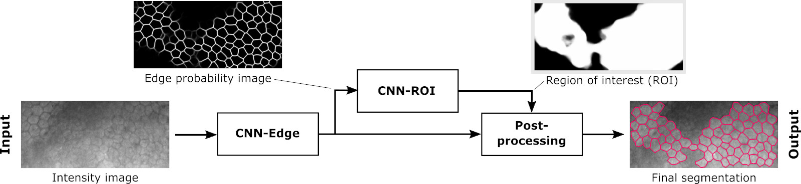

# Segmenting the Corneal Endothelium: Methodology presented in the Translational Vision Science & Technology (TVST) journal.
#### by Juan P. Vigueras-Guillén et al. (https://www.researchgate.net/profile/Juan-Vigueras-Guillen) 
#### Paper can be downloaded from: https://tvst.arvojournals.org/article.aspx?articleid=2770688

A deep learning method presented in the Translational Vision Science & Technology (TVST) journal to segment cells from corneal endothelium images obtained with specular microscopy and subsequently infer the corneal parameters (cell density, coefficient of variation, and hexagonality).

## Abstract

**Purpose**: To present a fully automatic method to estimate the corneal endothelium parameters fromspecular microscopy images and to use it to study a one-year follow-up after ultrathin Descemet stripping automated endothelial keratoplasty.

**Methods**: We analyzed 383 post ultrathin Descemet stripping automated endothelial keratoplasty images from 41 eyes acquired with a Topcon SP-1P specular microscope at 1, 3, 6, and 12 months after surgery. The estimated parameters were endothelial cell density (ECD), coefficient of variation (CV), and hexagonality (HEX). Manual segmentation was performed in all images.

**Results**: Ourmethod provided an estimate for ECD, CV, and HEX in 98.4% of the images, whereas Topcon's software had a success rate of 71.5% for ECD/CV and 30.5% for HEX. For the images with estimates, the percentage error in our method was 2.5% for ECD, 5.7% for CV, and 5.7% for HEX, whereas Topcon’s software provided an error of 7.5% for ECD, 17.5% for CV, and 18.3% forHEX.Our method was significantly better than Topcon's (P < 0.0001) and was not statistically significantly different from the manual assessments (P > 0.05). At month 12, the subjects presented an average ECD = 1377 ± 483 [cells/mm<sup>2</sup>], CV = 26.1 ± 5.7 [%], and HEX = 58.1 ± 7.1 [%].

**Conclusions**: The proposed method obtains reliable and accurate estimations even in challenging specular images of pathologic corneas.

**Translational Relevance**: CV and HEX, not currently used in the clinic owing to a lack of reliability in automatic methods, are useful biomarkers to analyze the postoperative healing process. Our accurate estimations allow now for their clinical use.

&nbsp;

<p align="center">

</p>
<p align="center">
<b>Fig. 1 </b> - Flowchart of the approach: Given a specular image, the CNN-Edge computes the edge-image where the cell edges are identified, the CNN-ROI uses the edge-image to determine the region of interest (ROI), and finally both images are processed to obtain the binary segmentation (in red, overimposed on the specular image for illustrative purposes).
</p>

&nbsp;

## Getting Started Guide

### Files

This repository contains a notebook (_TVST_paper_testing.ipynb_) to illustrate the methodology. The notebook was created to be launched in Google Colaboratory. The remaining files are:

* **Images**: A representative example of a specular image, and the resulting edge-image and ROI-image of our method.
* **Weights**: The weights of the networks (H5 file). These can be retrieved from https://drive.google.com/drive/folders/17xVFy7UfnHH66PfN5zlxv5swHwc-Ecdx
* **Postprocessing**: Three MATLAB functions that deals with the postprocessing: how the edge and ROI images are processed to produced the final binary image segmentation.


### Citation

If you use significant portions of our code or ideas from our paper in your research, please cite our work:
```
@article{vigueras2020tvst,
  title   = {Deep learning for assessing the corneal endothelium from specular microscopy images up to one year after ultrathin-DSAEK surgery},
  author  = {Juan P. Vigueras-Guillén and Jeroen van Rooij and Angela Engel and Hans G. Lemij and Lucas J. {van Vliet} and Koenraad A. Vermeer},
  journal = {Translational Vision Science \& Technology},
  year    = {2020},
  volume  = {9},
  number  = {2},
  pages   = {49},
  doi     = {https://doi.org/10.1167/tvst.9.2.49},
  year={2020}
}
```

## Note

An new version of the methodology can be found in our newest publication. Code available in the repository: https://github.com/jpviguerasguillen/feedback-non-local-attention-fNLA
